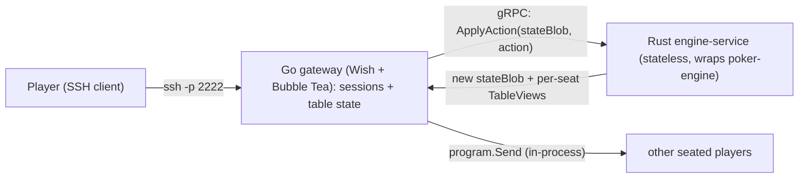

# SSH Poker Game

A multiplayer Texas Hold'em game you play over SSH, in your terminal. This
repository is **mid-migration** from an all-Rust implementation to a hybrid
architecture: a Go front end (Charm's Wish + Bubble Tea) backed by the existing
Rust poker engine, exposed as a stateless gRPC rules service.

> **Honest status, June 2026.** Earlier versions of this README described the
> project as a "production-ready" all-Rust server. That was not accurate: a
> review found the Rust game engine was solid but the SSH/TUI layer never
> rendered to clients and authentication was bypassed. We have since stabilized
> the engine and are rebuilding the front end. This README now reflects the
> *actual* state of the repo. The full story is in the
> [Architecture Decision Records](docs/adr/README.md).

## Architecture in brief



- **Front end - Go (Charm.sh).** [Wish](https://github.com/charmbracelet/wish)
  serves SSH and turns each session into a
  [Bubble Tea](https://github.com/charmbracelet/bubbletea) TUI, styled with
  [Lip Gloss](https://github.com/charmbracelet/lipgloss). Go owns the SSH
  sessions and the **authoritative table state**.
- **Engine - Rust over gRPC.** The proven `poker-engine` is wrapped by a
  stateless `engine-service` (tonic). Given a state and an action it returns the
  next state plus a rendered view per seat. It is a pure function; it remembers
  nothing between calls.
- **State is opaque; views are typed.** The authoritative `GameState` crosses the
  boundary as an opaque serialized blob that Go stores but never interprets;
  Rust returns per-seat `TableView`s, and a player only ever receives their own
  hole cards. This keeps the contract tiny and is server-authoritative by design.
- **Multiplayer is in-process.** Because sessions and state both live in Go, one
  player's action fans out to the others via Bubble Tea's `program.Send` - no
  gRPC streaming needed.

This is "Option A" of the migration; the reasoning (and the options rejected) is
in [ADR-0002](docs/adr/0002-go-frontend-rust-engine.md).

## Current status

- **Rust `poker-engine`: stabilized and green.** Correctness bugs (including an
  all-in infinite loop) fixed; the test suite compiles and passes; `clippy -D
  warnings` is clean. See
  [ADR-0001](docs/adr/0001-stabilize-the-rust-baseline.md).
- **Contract + toolchain: in place and verified.** The gRPC contract
  (`proto/poker/v1/poker.proto`), codegen wiring, and the Dev Container all exist;
  Go codegen and `go build` pass inside the container.
- **`engine-service` and the Go gateway: scaffolds.** They build and exercise
  codegen today; the real RPCs (M3) and the SSH/TUI front end (M4-M7) are the
  work in progress.
- **Deferred (not built):** authentication, AI bots, persistence, metrics, and a
  future streaming upgrade. The old Rust SSH/TUI crates
  (`crates/ssh-poker-server`, `crates/poker-tui`) will be retired once the Go
  front end reaches parity.

Track progress on GitHub Project board #2 (milestones M1-M12); the
[roadmap](docs/roadmap.md) narrates each milestone.

## Quick start (Dev Container)

Everything builds inside a [Dev Container](https://containers.dev/), so you only
need **Docker** and an editor/CLI that supports the Dev Containers spec - no Go,
Rust, or `protoc` on your host
([ADR-0003](docs/adr/0003-dev-container-environment.md)).

1. Open this folder in a Dev Container (e.g. VS Code: "Reopen in Container").
   The container provisions Go, Rust 1.82.0, `protoc`, the Go protobuf plugins,
   and `buf`, and prints their versions on creation.
2. Generate code and build both halves:

```bash
make proto      # generate gRPC code for Go and Rust
make build      # build the Rust workspace and the Go gateway
make test       # run the Rust and Go test suites
```

See the [development guide](docs/development.md) for the full workflow
(regenerating code, the branch/PR conventions, and quality checks).

## Repository layout

```
ssh-poker-game/
  proto/poker/v1/poker.proto   # the gRPC contract (source of truth)
  crates/
    poker-engine/              # the rules engine (stable, green) - the asset
    engine-service/            # tonic gRPC server wrapping poker-engine (scaffold)
    data-store/ ai-bot/ hybrid-metrics/   # deferred, left in place
    ssh-poker-server/ poker-tui/          # legacy SSH/TUI, retiring after parity
  gateway/                     # Go module: Wish + Bubble Tea + gRPC client (scaffold)
    cmd/poker-gateway/main.go
    internal/pokerpb/          # generated Go code from the proto
  Makefile                     # make proto / build / test for both halves
  .devcontainer/               # the one reproducible toolchain
  docs/                        # documentation hub (start at docs/README.md)
```

## Documentation

The documentation is the single, cohesive narrative of what this project is, why
it is built this way, and how to work on it. **Start here:**

- **[Documentation hub](docs/README.md)** - the orientation page and reading
  order.
- **[Architecture Decision Records](docs/adr/README.md)** - the "why" behind
  every major decision:
  - [ADR-0001: Stabilize the Rust baseline](docs/adr/0001-stabilize-the-rust-baseline.md)
  - [ADR-0002: Go front end with a Rust rules engine](docs/adr/0002-go-frontend-rust-engine.md)
  - [ADR-0003: A Dev Container is the canonical environment](docs/adr/0003-dev-container-environment.md)
  - [ADR-0004: gRPC contract with opaque state](docs/adr/0004-grpc-contract-and-opaque-state.md)
  - [ADR-0005: Keep one monorepo](docs/adr/0005-monorepo-structure.md)
  - [ADR-0006: Layered testing strategy](docs/adr/0006-testing-strategy.md)
  - [ADR-0007: CI/CD gates and releases](docs/adr/0007-ci-cd-pipeline.md)
  - [ADR-0008: Security posture](docs/adr/0008-security-posture.md)
- **[Architecture overview](docs/architecture/overview.md)** - components, data
  flow, and diagrams.
- **[Roadmap](docs/roadmap.md)** - the M1-M12 milestone plan.
- **[Development guide](docs/development.md)** - environment, codegen, build/test,
  and the contribution workflow.
- **[References](docs/references.md)** - curated external reading (Charm, gRPC,
  tonic, TDD, poker hand evaluation, SSH security, and more).

## License

MIT License. The crates are published under MIT (`license = "MIT"` in
`Cargo.toml`); a top-level `LICENSE` file is not yet committed.
