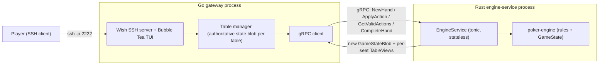
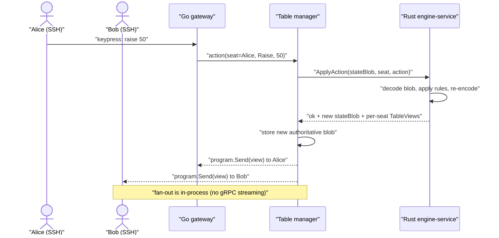
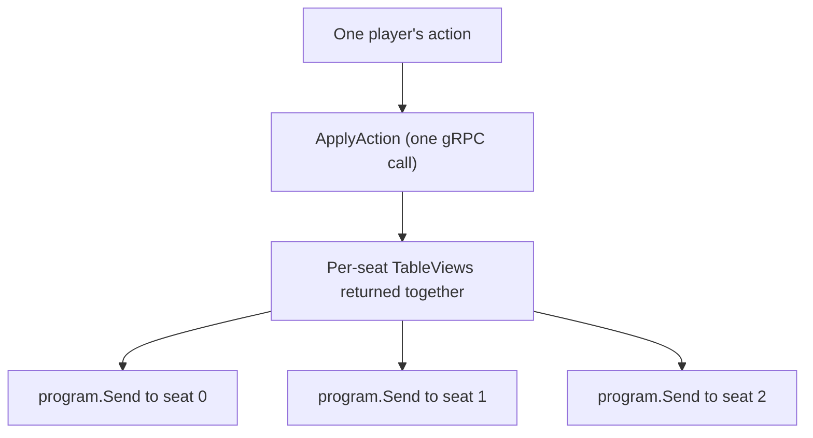

# Architecture overview

This page describes the system **as it is being built today**: the components,
what each one is responsible for, and how data flows from a player's keystroke to
every seated player's screen. It is the "resulting system" companion to the
[Architecture Decision Records](../adr/README.md), which explain *why* each of
these choices was made.

> Status note: the migration is in progress. The Rust engine
> (`crates/poker-engine`) is stabilized and green
> ([ADR-0001](../adr/0001-stabilize-the-rust-baseline.md)); the gRPC contract
> (`proto/poker/v1/poker.proto`) and the Dev Container are in place and verified;
> the Rust `engine-service` and the Go gateway currently exist as **scaffolds**
> (they prove codegen and build, with the real RPCs and TUI landing in M3-M7).
> Where a component is not built yet, this page says so.

## The shape in one sentence

A player connects over **SSH** to a **Go gateway** (Charm's Wish + Bubble Tea),
which owns the session and the authoritative table state; to advance a hand the
gateway calls a **stateless Rust `engine-service`** over **gRPC**, which returns
the new state plus a rendered view for each seat; the gateway then pushes each
seated player their view **in-process**.

## Components and responsibilities

| Component | Language / stack | Owns | Status |
| --- | --- | --- | --- |
| SSH client | any OpenSSH-compatible client | the player's terminal | external |
| Gateway | Go: [Wish](https://github.com/charmbracelet/wish) (SSH) + [Bubble Tea](https://github.com/charmbracelet/bubbletea) (TUI) + [Lip Gloss](https://github.com/charmbracelet/lipgloss) (styling) | SSH sessions, lobby, **authoritative table state (opaque blob)**, rendering, multiplayer fan-out | scaffold (M4-M7) |
| gRPC contract | Protocol Buffers (`proto/poker/v1/poker.proto`) | the shared, versioned API between Go and Rust | defined (M2) |
| Engine service | Rust: tonic + prost, wrapping `poker-engine` | a **stateless** rules function: `(state, action) -> (new state, per-seat views)` | scaffold (M3) |
| Poker engine | Rust (`crates/poker-engine`) | the actual Texas Hold'em rules and `GameState` | stable & green |

Key responsibility boundaries, drawn deliberately
([ADR-0002](../adr/0002-go-frontend-rust-engine.md),
[ADR-0004](../adr/0004-grpc-contract-and-opaque-state.md)):

- **Go owns connections *and* state.** Because the SSH sessions live in Go, and
  the authoritative state also lives in Go, fan-out to other players is a local,
  in-process operation - no streaming RPC, no cross-process state sync.
- **Rust owns the rules, statelessly.** The engine never remembers anything
  between calls. Each call receives the current state (as an opaque blob or a
  hand config) and returns the next state. This is what makes it trivially safe
  to call concurrently and easy to test as a pure function.
- **The state is opaque to Go.** The authoritative `GameState` crosses the
  boundary as `GameStateBlob { bytes data }` - serde-encoded by the engine. Go
  stores and round-trips it without interpreting it. Rust returns typed,
  per-seat `TableView`s for rendering, and a seat's `hole_cards` are populated
  **only** for that viewer's own seat - so the gateway cannot leak cards it never
  receives.

## System context



## The four RPCs

The contract is intentionally small - four calls that match a hand's lifecycle
(full detail in [ADR-0004](../adr/0004-grpc-contract-and-opaque-state.md) and the
proto file `proto/poker/v1/poker.proto`):

| RPC | Purpose | Returns |
| --- | --- | --- |
| `NewHand` | start a hand from a `NewHandRequest` (players, blinds, dealer) | `HandState` = new blob + per-seat `TableView`s |
| `ApplyAction` | apply one seat's `Action` to the current state | `ApplyActionResult` = ok/error + new blob + views + `hand_complete` |
| `GetValidActions` | ask what the to-act seat may legally do | `ValidActions` for the current seat (drives the action bar) |
| `CompleteHand` | resolve the showdown | `CompleteHandResult` = final blob + `Winning`s + views |

Because `HandState`, `ApplyActionResult`, and `CompleteHandResult` each bundle a
`repeated TableView views`, a single call gives the gateway everything it needs
to update **every** seated player without a round-trip per viewer.

## End-to-end data flow: a player acts

This is the core loop. A player presses a key (say, "raise"); every seated player
should see the result.



Step by step:

1. **Input.** Wish's Bubble Tea middleware delivers the keypress to Alice's
   `tea.Model` as a message. The model translates it into a domain action.
2. **Authoritative call.** The table manager - the single owner of this table's
   state blob - calls `ApplyAction` on the engine with the current blob, the
   acting seat, and the action.
3. **Pure transition.** The stateless engine decodes the blob, runs the rules
   (validate the action, advance betting, deal the next street, or run the board
   out if everyone is all-in), and re-encodes the new state. It also builds a
   `TableView` per seat.
4. **State update.** The table manager replaces its stored blob with the new one.
   The engine is now free to forget everything; the gateway is the source of
   truth.
5. **Fan-out.** For each seated session, the table manager calls that player's
   `tea.Program.Send` with their `TableView`. This is the standard Wish
   multiplayer pattern and the reason Option A was chosen
   ([ADR-0002](../adr/0002-go-frontend-rust-engine.md)): the thing that must push
   updates (the SSH session) and the thing that owns state (the table) are in the
   same process.
6. **Render.** Each player's `View()` renders their `TableView` with Lip Gloss
   styling. Alice sees her own hole cards; Bob sees Alice's seat as public
   information only.

## Multiplayer fan-out, a little closer

The table manager holds, per table, the authoritative `GameStateBlob` and a
reference to each seated session's `tea.Program`. One engine call produces one
`TableView` per seat; the manager routes each view to the matching program.



This is why no server-streaming RPC is needed: the engine does not push anything,
it just returns all the views at once, and Go does the pushing locally. A future
streaming upgrade (Option B) is explicitly **deferred**.

## What is deliberately not here (deferred)

These are described as deferred throughout the docs and are **not** part of the
current architecture:

- **Authentication.** Guest identity only for now (prompt for a display name on
  connect). The vetted `secure_auth` (Argon2 + lockout) is designed for re-enable
  later ([ADR-0008](../adr/0008-security-posture.md)).
- **AI bots, persistence / data-store, and metrics.** The corresponding crates
  (`ai-bot`, `data-store`, `hybrid-metrics`) are left in place, untouched, on the
  back burner.
- **A streaming engine (Option B).** Considered and deferred in favor of the
  simpler in-process fan-out
  ([ADR-0002](../adr/0002-go-frontend-rust-engine.md)).
- **The old Rust SSH/TUI layer** (`crates/ssh-poker-server`, `crates/poker-tui`)
  is scheduled for **retirement** once the Go front end reaches parity
  ([ADR-0005](../adr/0005-monorepo-structure.md)).

## Where the code lives

```
ssh-poker-game/
  proto/poker/v1/poker.proto   # the gRPC contract (source of truth)
  crates/
    poker-engine/              # the rules engine (stable, green)
    engine-service/            # tonic gRPC server wrapping poker-engine
  gateway/                     # Go module: Wish + Bubble Tea + gRPC client
    cmd/poker-gateway/main.go
    internal/pokerpb/          # generated Go code from the proto
  Makefile                     # make proto / build / test for both halves
  .devcontainer/               # the one reproducible toolchain (ADR-0003)
```

## Complexity and trade-offs

It is worth being honest about the shape of this system, because the docs
elsewhere argue *for* the design and a fair reader deserves the counter-weight in
one place. The blunt summary: **the problem is low-to-moderate complexity; the
architecture is moderate-to-high.** Turn-based poker with a handful of players
and tiny payloads is not, in itself, a hard distributed-systems problem. The gap
between the two is **accidental complexity that we take on deliberately** - not
because the problem demands it. Naming that gap explicitly is the point of this
section.

### Essential complexity (irreducible)

This part is genuinely hard no matter how you build it, and it lives in the Rust
engine:

- **The poker rules themselves** - betting rounds, minimum-raise enforcement,
  side pots, all-in handling, run-out to showdown, and hand evaluation. This is
  intricate, full of edge cases, and exactly where bugs hurt (see the all-in hang
  in [ADR-0001](../adr/0001-stabilize-the-rust-baseline.md)).
- **Multiplayer real-time shared state** - many players observing and mutating
  one authoritative table, each seeing a different view of it, in something close
  to real time.

You cannot wish either of these away; they are the substance of the product.

### Accidental complexity (chosen)

This part is a consequence of *how* we decided to build it, and a single-language
application would simply not have it:

- **Two languages** (Go and Rust) and **two processes** (gateway and engine).
- **A gRPC boundary** with a Protocol Buffers contract to define and maintain.
- **Code generation** on both sides, and the drift risk that comes with it.
- **The authoritative state serialized on every action** as it crosses the wire.
- **Two toolchains and two CI paths**, and **distributed debugging** when
  something goes wrong across the boundary rather than within one call stack.

An all-Go or an all-Rust application would be **objectively simpler at this
scale** - one language, one process, one build, in-memory calls instead of a
serialized RPC. And recall from
[ADR-0002](../adr/0002-go-frontend-rust-engine.md) that **Rust is not here for
performance**; poker is turn-based with tiny payloads. The boundary buys
learning, engine reuse, and clean separation - not throughput.

### What keeps it controlled

The accidental complexity is real but deliberately *bounded*, and the bounding is
the whole reason the design is defensible:

- **Option A keeps the boundary thin.** Because Go owns both the SSH sessions and
  the authoritative state, multiplayer fan-out is an in-process `program.Send` -
  there is **no streaming RPC and no cross-process state synchronization**. The
  hardest part of "two processes" (keeping distributed state in sync) is designed
  out, not managed.
- **Opaque state + typed views keep the contract tiny.** The engine's `GameState`
  crosses as an opaque blob and Rust returns per-seat `TableView`s, so there is
  **no duplicated domain model** to keep in sync across two languages
  ([ADR-0004](../adr/0004-grpc-contract-and-opaque-state.md)).
- **Wish + Bubble Tea deletes the hardest custom component.** The SSH-to-TUI
  bridge - the exact thing the all-Rust version kept failing to build - is now an
  off-the-shelf, battle-tested middleware
  ([ADR-0002](../adr/0002-go-frontend-rust-engine.md)).
- **The supporting practices absorb the rest.** The Dev Container makes the
  two-toolchain setup reproducible ([ADR-0003](../adr/0003-dev-container-environment.md)),
  the ADRs keep the reasoning legible, and the cross-language test pyramid covers
  the seams the boundary introduces ([ADR-0006](../adr/0006-testing-strategy.md)).

### What to watch

Bounded is not the same as free. These are the places where the chosen complexity
could turn into a problem, and where vigilance is required:

- **The cross-language contract is the top risk surface.** Two generated code
  paths that silently disagree is the failure mode unique to this design, which
  is why the **codegen-drift CI check (issue #27) is load-bearing, not optional**
  ([ADR-0006](../adr/0006-testing-strategy.md),
  [ADR-0007](../adr/0007-ci-cd-pipeline.md)).
- **The engine's dual phase-advance logic is still a little fragile.** Noted as a
  retained risk in [ADR-0001](../adr/0001-stabilize-the-rust-baseline.md); it sits
  in the essential-complexity core, so it deserves the most test attention.
- **The two-service operational surface.** Running and deploying two processes is
  more than one; keep it to a **single `docker compose` story** (M8) so "two
  services" never becomes "two bespoke deploy procedures."
- **Spend the complexity budget consciously.** Every deferred feature, when it
  returns, now lands on **both sides of the boundary**: re-enabling auth,
  persistence, or AI bots is more work here than in a single-language app
  ([ADR-0008](../adr/0008-security-posture.md)). Re-justify each feature against
  the boundary cost when its time comes, rather than assuming the split is free.

### Verdict

For a project whose goal is to **learn and practice real production patterns**,
this is *appropriately* complex: it exercises gRPC contracts, codegen, a
service boundary, and a polyglot toolchain on a domain simple enough not to fight
back. If the goal were instead "ship the smallest correct poker server,"
**all-Go with no boundary would win** outright. Given the actual goals (recorded
in [ADR-0009](../adr/0009-learning-sandbox-and-consolidation-path.md)), the design
is defensible **as long as three disciplines hold**: the boundary stays thin
(Option A discipline), the contract stays CI-enforced (the drift check), and the
"two of everything" tax does not quietly creep upward.

## Related reading

- [ADR-0002](../adr/0002-go-frontend-rust-engine.md) - why this hybrid shape
  (Option A) at all.
- [ADR-0009](../adr/0009-learning-sandbox-and-consolidation-path.md) - the
  learning-sandbox intent and the consolidation exit path.
- [ADR-0004](../adr/0004-grpc-contract-and-opaque-state.md) - the contract and
  the opaque-state / per-seat-view design.
- [Development guide](../development.md) - how to build and run it.
- [Roadmap](../roadmap.md) - the milestone-by-milestone plan that fills in the
  scaffolds.
- [External references](../references.md) - Charm, gRPC/protobuf, tonic, and Go
  concurrency sources.
