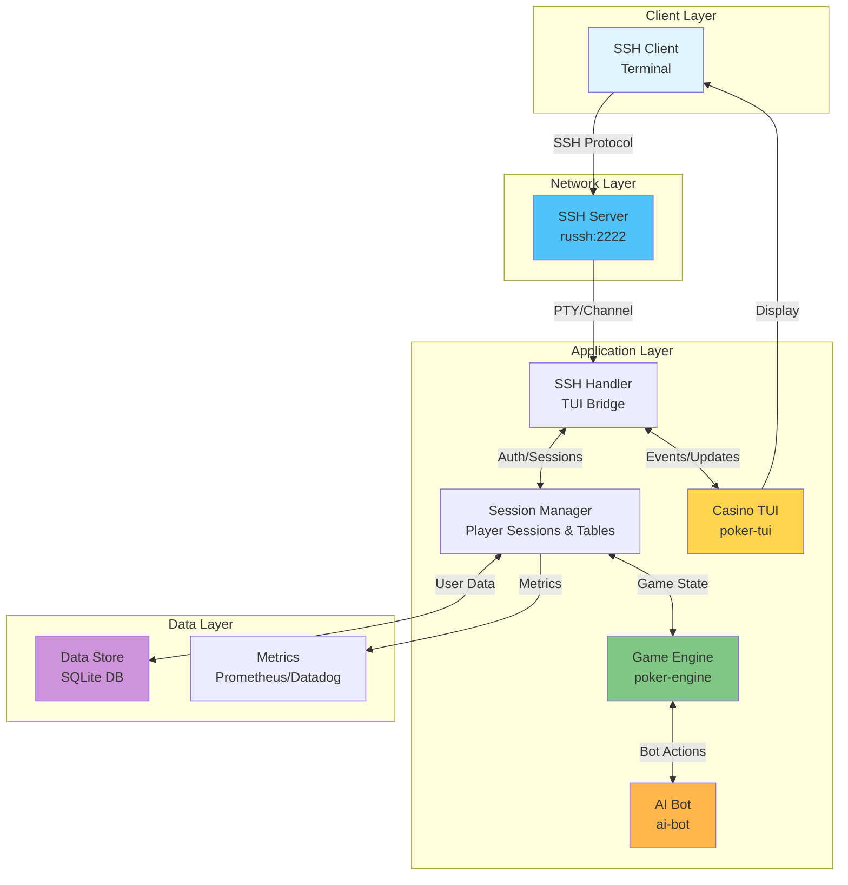
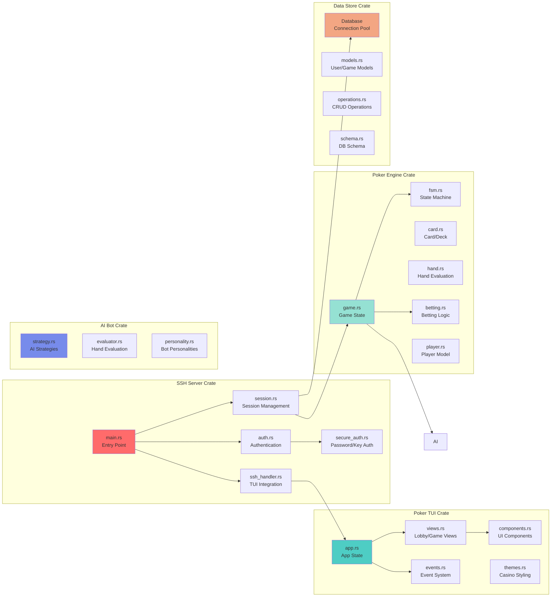
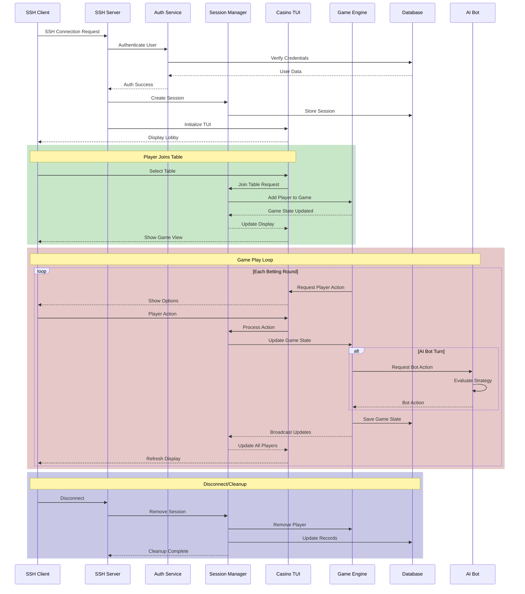

# SSH Poker Game - Architecture Diagrams

This document provides visual representations of the system architecture, component structure, and data flow for the SSH Poker Game.

## 1. System Architecture Overview

The system follows a layered architecture with clear separation of concerns:

### Key Components:
- **Client Layer**: Any SSH-compatible terminal client
- **Network Layer**: SSH server handling secure connections
- **Application Layer**: Core game logic and UI management
- **Data Layer**: Persistent storage and monitoring

## 2. Component Architecture

Detailed view of the internal structure of each crate:

### Crate Responsibilities:
- **ssh-server**: Network handling, authentication, and session management
- **poker-tui**: Beautiful casino-themed terminal interface
- **poker-engine**: Core game logic and state management
- **data-store**: Database operations and user management
- **ai-bot**: Intelligent computer opponents

## 3. Data Flow Diagram

Sequence diagram showing the flow of data through the system during a typical game session:

### Key Data Flows:
1. **Authentication Flow**: SSH → Auth Service → Database → Session Creation
2. **Game Join Flow**: TUI → Session Manager → Game Engine → State Update
3. **Game Play Flow**: Player Input → Game Engine → State Updates → Broadcast to All Players
4. **AI Integration**: Game Engine → AI Bot → Strategy Evaluation → Action Response
5. **Cleanup Flow**: Disconnect → Session Removal → Game State Update → Database Update

## Architecture Principles

### 1. Separation of Concerns
Each crate has a specific responsibility:
- Network handling is isolated in ssh-server
- UI logic is contained in poker-tui
- Game rules are enforced by poker-engine
- Data persistence is managed by data-store

### 2. Event-Driven Architecture
The system uses an event-driven approach:
- User inputs generate events
- Game state changes trigger updates
- All clients receive real-time updates

### 3. Security by Design
- SSH provides encrypted communication
- Authentication happens before any game access
- Session management prevents unauthorized access
- Game state is server-authoritative to prevent cheating

### 4. Scalability Considerations
- Session Manager can handle multiple concurrent games
- Each table is independent for horizontal scaling
- Database connection pooling for efficient resource usage
- Async/await pattern for handling concurrent connections

## Future Architecture Enhancements

1. **Microservices**: Split game engine into separate service for better scaling
2. **Message Queue**: Add Redis/RabbitMQ for event distribution
3. **Load Balancer**: Add HAProxy for distributing SSH connections
4. **Caching Layer**: Add Redis for session and game state caching
5. **API Gateway**: RESTful API for web/mobile clients